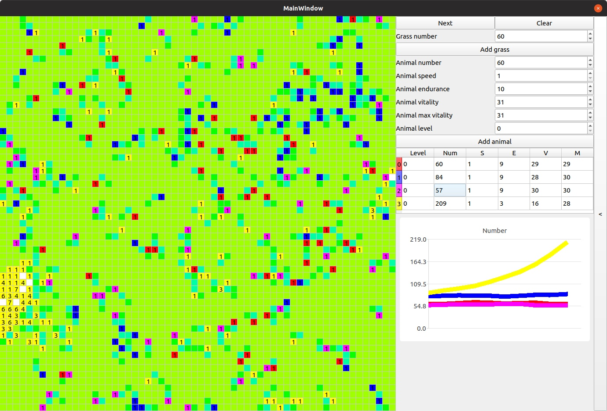

# another_cellular_automaton

  

# Правила симуляции

* На игровом поле случайным образом располагаются звери и трава;
* Каждый ход трава вырастает, при максимальном росте заполняет соседние клетки травой меньшего размера;
* Звери имеют 5 параметров - уровень, скорость, утомляемость, текущий запас энаргии, максимальный запас энергии;
* Каждый ход звери совершают перемещение в случайном направлении на расстояние не превосходящее по значению параметр скорости;
* После перемещения животные теряют количество энергии равное параметру утомляемости. Если после этого текущий запас энергии <= 0, то животное умирает;
* Животные восполняют потерянную энергию пищей. Животные с уровнем 0 едят траву. Остальные животные едят животных меньшего уровня.
* Если в одной ячейке находится несколько особей, то они дают потомство. Параметры потомков определяются генетическими алгоритмами. При размножении родители теряют половину текущего запаса энергии.

# Возможности приложения

* Для перехода к следующей итерации нужно нажать на кнопку `Next`
* Для очистки поля нажать на кнопку `Clear`
* Для добавления травы указать колличество и нажать на кнопку `Add grass`
* Для добавления животного указать колличество и нажать на кнопку `Add animal`. На данный момент может существовать не более 4х зверей. Колличество ограничено цветовыми отметками.
* Чтобы удалить животное нужно два раза нажать по ячейке с уровнем этого животного
* Чтобы просмотреть график изменения средних параметров популяции нужно два раза щелкнуть на соответсвующую колонку 

